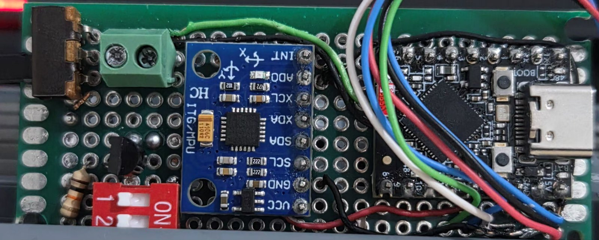
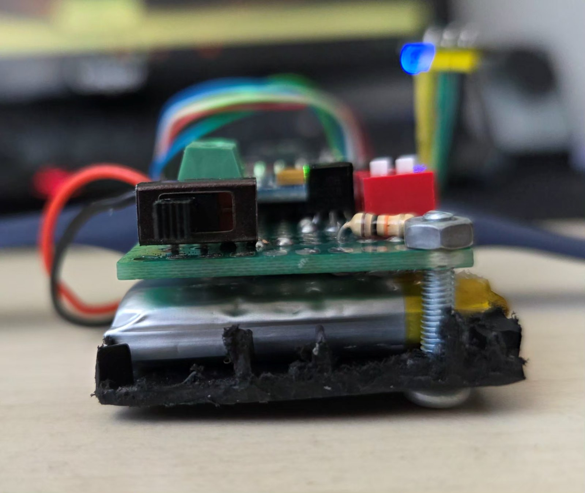
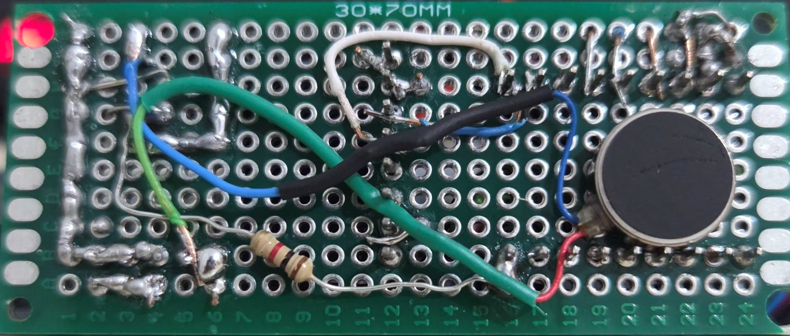

# Malzeme Listesi

## Ana bileşenler

| # | Bileşen | Adet | Notlar |
|---|---|---|---|
| 1 | **ESP32-S3 Super Mini** (USB-C) | 1 | 4 MB flash, dahili WS2812 (GPIO48) ve BOOT tuşu (GPIO0) kartın üzerinde. `platformio.ini` bu karta göre yapılandırılmış. |
| 2 | **INMP441** I2S MEMS mikrofon modülü | 1 | `L/R` pini **GND**'ye bağlanır (kod `ONLY_LEFT` kullanıyor) |
| 3 | **MPU6050** / GY-521 IMU modülü | 1 | I2C adresi `0x68`, 400 kHz |
| 4 | **Coin (pancake) ERM titreşim motoru** | 1 | 10 mm, 3 V. Karta alt yüzden monteli |
| 5 | **LiPo pil** | 1 | Tek hücre 3.7 V. Kartın altına sandviç olarak yerleşiyor |
| 6 | **Delikli plaket (perfboard)** 30×70 mm | 1 | Fotoğraflardaki yerleşimin taban ölçüsü |

## Motor sürücü devresi

| # | Bileşen | Adet | Notlar |
|---|---|---|---|
| 7 | **Transistör / MOSFET** (TO-92) | 1 | Motor anahtarlama. BJT ise (S8050, 2N2222) taban direnci ~1 kΩ; logic-level MOSFET ise (2N7000, AO3400) gate direnci gerekmez ama **pull-down şart** |
| 8 | **Direnç** | 1 | BJT'de taban direnci, MOSFET'te gate pull-down (10 kΩ) |
| 9 | **Flyback diyot** (1N5819 / 1N4148) | 1 | ⚠️ Bkz. aşağıdaki not |
| 10 | **Elektrolitik kondansatör** 220–470 µF | 1 | Motor kalkış akımı için bulk kapasite |
| 11 | **Seramik kondansatör** 100 nF | 1 | Motor uçlarına, fırça gürültüsü bastırma |

> ⚠️ **Doğrulama gerekiyor:** Fotoğraflarda motor sürücüsü olarak **bir TO-92 transistör ve bir direnç** görünüyor; **flyback diyot ve bulk kapasiteyi seçemedim.** Kartın alt yüzünde olabilirler ya da hiç takılmamış olabilirler. Yoksa eklenmeli — bu üç bileşen [DONANIM.md](DONANIM.md)'de anlatıldığı gibi BLE kopmalarının ve motorun takılı kalmasının doğrudan sebebi. 8 no'lu direncin gerçek değerini ve transistörün üstündeki kodu kontrol edip bu tabloyu güncelle.

## Mekanik ve arayüz

| # | Bileşen | Adet | Notlar |
|---|---|---|---|
| 12 | **Slayt anahtar** (güç) | 1 | Pil hattını keser |
| 13 | **DIP anahtar**, 2'li | 1 | Mod/konfigürasyon için ayrılmış |
| 14 | **Vidalı klemens**, 2 pin | 1 | Motor veya pil bağlantısı için sökülebilir uç |
| 15 | **Saat kayışı** (silikon) | 1 | Bileğe montaj |
| 16 | **M2 vida + somun** | 2–4 | Kart–pil–kayış sandviçini sıkıştırır |
| 17 | Tek damar montaj kablosu | — | Fotoğraflardaki renk kodlu ince kablo |

---

## Yerleşim

Kart, pil ve kayış üç katlı bir sandviç oluşturuyor; toplam yükseklik saat kasası kadar:

Titreşim motoru plaketin **alt yüzünde**, mikrofon ise kablo ucunda ayrı duruyor — bu ayrım kasıtlı: motor mikrofonun hemen yanındaki mekanik bir gürültü kaynağı, ikisini fiziksel olarak ayırmak yazılımdaki sağırlaştırma penceresinin işini kolaylaştırıyor.

---

## Pin bağlantıları

Tam tablo ve motor sürücü şeması için: **[DONANIM.md](DONANIM.md)**

| İşlev | Pin |
|---|---|
| I2S WS / SCK / SD | GPIO11 / 12 / 13 |
| I2C SDA / SCL | GPIO8 / GPIO9 |
| Motor kapısı | GPIO7 |
| RGB LED | GPIO48 (dahili) |
| BOOT tuşu | GPIO0 (dahili) |
